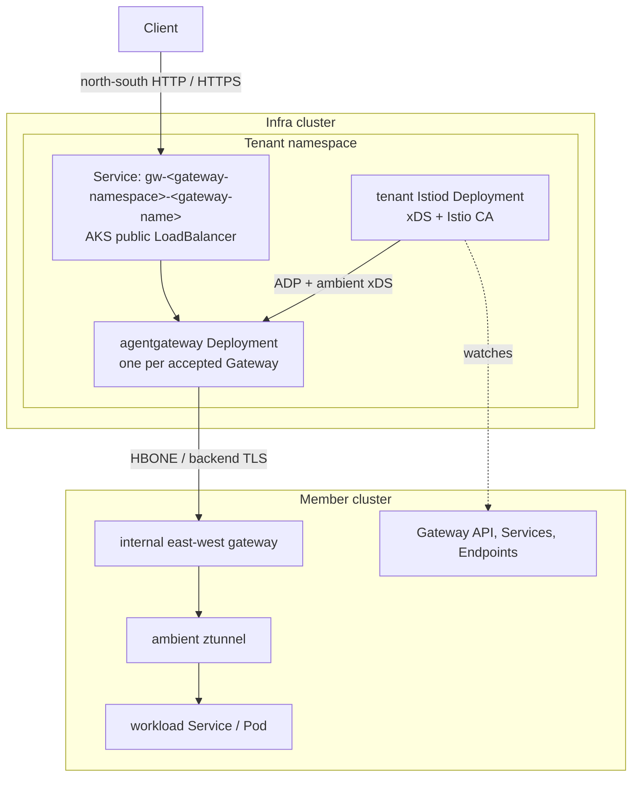
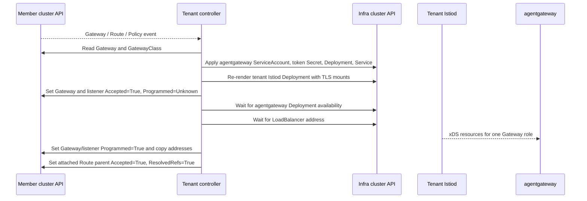
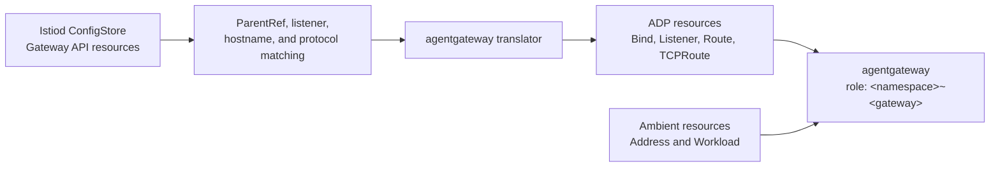
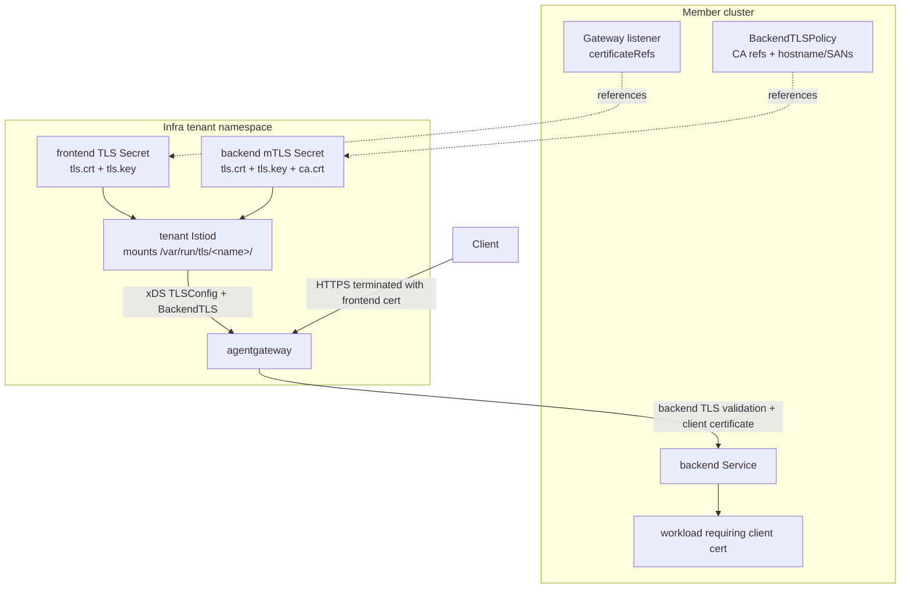

# Managed gateway design

## Overview

This repository implements a managed, out-of-cluster Gateway API control plane for member Kubernetes clusters. The main idea is that tenants define Gateway API resources in their own member clusters, while the managed gateway data plane and tenant control plane run in an infra cluster owned by the service provider.

The current AKS MVP validates this topology with three clusters:

- `aks-infra`: provider-owned infra cluster that runs one tenant controller, one tenant Istiod, and one managed `agentgateway` Deployment per accepted Gateway.
- `aks-workload-alice`: Alice member cluster that owns Alice's Gateway API objects and workloads.
- `aks-workload-bob`: Bob member cluster that owns Bob's Gateway API objects and workloads.

Traffic enters a public Azure LoadBalancer in the infra cluster, reaches an `agentgateway` instance scoped to a single member-cluster Gateway, receives xDS from the tenant Istiod, and is forwarded through ambient cross-network connectivity to workloads in the member cluster.



## Goals

- Let member clusters keep ownership of their Gateway API resources, Services, Endpoints, and workloads.
- Keep provider-managed data-plane infrastructure in the infra cluster.
- Keep tenant TLS private keys and backend client certificates out of member clusters when those certificates are managed by the provider.
- Reuse Istio ambient and Istio Gateway API semantics where possible instead of building a complete service registry and xDS implementation from scratch.
- Translate Gateway API resources into `agentgateway.dev.resource.Resource` xDS resources consumed by agentgateway.
- Validate the MVP with executable AKS E2E tests and progressively add Gateway API conformance coverage.

## Non-goals in the current MVP

- A production tenant/member registration API.
- Full production RBAC hardening for member-cluster access.
- Complete Gateway API v1.5 conformance.
- Multi-region, multi-VNet, cross-subscription, or private-link deployment models.
- Managed lifecycle for CA rotation, revocation, and emergency rollover beyond the AKS scripts.
- Replacing the forked Istio and agentgateway changes with upstreamed implementations.

## Major components

### Per-tenant controller

The controller binary in `controller/cmd/controller/main.go` runs once per tenant in that tenant's infra namespace. It is intentionally scoped to one tenant and one member cluster.

Responsibilities:

1. Load a member-cluster kubeconfig from an infra-cluster Secret.
2. Start a controller-runtime cache against the member cluster.
3. Watch Gateway API resources in the member cluster.
4. Provision infra-cluster objects for accepted member Gateways:
   - `ServiceAccount` for agentgateway.
   - projected member-cluster Istio token Secret for agentgateway.
   - `Deployment` for agentgateway.
   - `Service` exposing agentgateway.
5. Render and refresh the tenant Istiod Deployment and Service.
6. Mount infra-cluster TLS assets into tenant Istiod based on Gateway listener `certificateRefs`, Gateway backend `clientCertificateRef`, and `BackendTLSPolicy` CA refs.
7. Write basic Gateway and listener status back to the member cluster.



The controller uses leader election, so multiple replicas can be deployed but only one active replica performs reconciliation. The AKS E2E validates leader failover by deleting the current leader pod and checking that another replica takes the lease.

### Member-cluster cache and event handling

`controller/internal/membercluster/reconciler.go` creates the member-cluster cache and installs informers for the Gateway API v1.5 Standard resource surface used by this MVP:

- `GatewayClass`
- `Gateway`
- `HTTPRoute`
- `GRPCRoute`
- `TLSRoute`
- `ReferenceGrant`
- `BackendTLSPolicy`
- `ListenerSet`

`Gateway` events enqueue the changed Gateway directly. Other Gateway API resource events enqueue all Gateways so that route, policy, and reference changes trigger a refresh of the infra data plane and tenant Istiod mount set.

This is intentionally simple: the MVP favors correctness and fast iteration over a precise reverse index from each Route/Policy/ReferenceGrant to affected Gateways. A production controller should replace the global refresh with indexed enqueueing and stronger backoff behavior.

### Gateway reconciler

`controller/internal/gateway/reconciler.go` reconciles a single member-cluster Gateway.

The reconciler only handles Gateways whose referenced GatewayClass has:

```text
spec.controllerName = gateway.azure.com/appnet-gateway.controller
```

For each handled Gateway, it renders provider-owned infra-cluster resources using `controller/internal/provisioner`:

- `AgentGatewayServiceAccountObject`
- member-token Secret via `ensureAgentGatewayMemberToken`
- `AgentGatewayDeployment`
- `AgentGatewayService`

The infra object name for a member Gateway is stable:

```text
gw-<gateway-namespace>-<gateway-name>
```

For example, member Gateway `demo/demo-gw` becomes infra Deployment and Service `gw-demo-demo-gw` in the tenant namespace.

The reconciler then calls `RefreshIstiod` so Istiod's mounted TLS Secret set matches the union of all handled Gateways and backend TLS policies for the tenant. After provisioning agentgateway, reconciliation waits briefly for the infra Deployment to report an available replica and for the infra LoadBalancer Service to receive an address before promoting Gateway and listener `Programmed=True`; if the data plane or address is still pending, the member event processor retries reconciliation.

### Provisioner

`controller/internal/provisioner/render.go` renders Kubernetes objects for tenant Istiod and per-Gateway agentgateway.

Important invariants:

- Managed pods set `automountServiceAccountToken: false` so neither tenant Istiod nor agentgateway receives an infra-cluster API token by default.
- Objects are labeled with `app.kubernetes.io/managed-by=appnet-gateway-controller` for ownership and future garbage collection.
- AKS mode renders Azure LoadBalancer Services.
- Tenant Istiod runs with a member-cluster kubeconfig mounted from the infra namespace.
- Tenant Istiod mounts provider-side TLS assets under `/var/run/tls/<name>/`.

Tenant Istiod environment includes:

- `PILOT_ENABLE_GATEWAY_API=true`
- `PILOT_ENABLE_GATEWAY_API_DEPLOYMENT_CONTROLLER=false`
- `PILOT_ENABLE_AMBIENT=true`
- `EXTERNAL_ISTIOD=true`
- `ENABLE_CA_SERVER=true`
- `PILOT_CERT_PROVIDER=istiod`

The built-in Istio Gateway deployment controller is disabled because this project provisions agentgateway itself in the infra cluster.

### Tenant Istiod fork

The forked Istiod watches the member cluster and builds the service, endpoint, workload, Gateway API, and ambient network state needed by agentgateway and member ambient components.

Key fork behavior:

- It uses Gateway API v1.5 Go types for runtime Gateway API clients and KRT collections.
- It exposes xDS to agentgateway on plaintext port `15010` inside the infra tenant namespace.
- It exposes secure xDS/CA services on `15012` for member ztunnel and east-west gateways.
- It has an additional agentgateway resource generator that translates Gateway API resources into agentgateway ADP resources.
- It keeps ambient support enabled so member workloads and services are represented as workload/address resources.

### agentgateway

agentgateway is the managed north-south data plane. The controller deploys one agentgateway Deployment per handled Gateway.

The Deployment receives these identity and routing inputs through environment variables:

- `XDS_ADDRESS=http://istiod.<tenant-namespace>.svc.cluster.local:15010`
- `NAMESPACE=<member-gateway-namespace>`
- `GATEWAY=<member-gateway-name>`
- `CLUSTER_ID=<tenant-name>`
- `CA_ADDRESS=https://istiod.<tenant-namespace>.svc.cluster.local:15012`
- `CA_ROOT_CA=/var/run/secrets/istio/root-cert.pem`
- `SERVICE_ACCOUNT=agentgateway`
- `NETWORK=infra`

agentgateway subscribes to:

- ADP resources for `Bind`, `Listener`, `Route`, and `TCPRoute`.
- Istio ambient address/workload resources for service discovery.

The per-Gateway routing key is the agentgateway role value:

```text
<gateway-namespace>~<gateway-name>
```

The Istiod generator uses this role to scope the xDS response to exactly one member-cluster Gateway.

## Gateway API translation

The agentgateway xDS translator lives in the `github.com/biefy/istio` fork at:

```text
pilot/pkg/xds/agentgateway_translate.go
```

It reads Gateway API config from Istiod's `ConfigStore` and emits `agentgateway.dev.resource.Resource` protobufs.



### Listener translation

For each `Gateway.spec.listeners[]`, the translator emits:

- one `Bind` keyed by namespace, Gateway name, and listener port;
- one `Listener` keyed by namespace, Gateway name, and listener name.

Protocol mapping:

| Gateway API protocol | agentgateway bind | agentgateway listener |
| --- | --- | --- |
| `HTTP` | HTTP | HTTP |
| `HTTPS` | TLS | HTTPS |
| `TLS` | TLS | TLS |
| `TCP` | TCP | TCP |

For terminating HTTPS/TLS listeners, `listenerTLSConfig` loads certificate material from tenant Istiod's `/var/run/tls/<secret-name>/tls.crt` and `/var/run/tls/<secret-name>/tls.key`. Standard `Gateway.spec.listeners[].tls.certificateRefs` are preferred; the older `appnet.azure.com/tls-cert` annotation is retained only for older manifests.

### ParentRef and listener matching

Routes attach to listeners by matching:

- `parentRefs.group` = `gateway.networking.k8s.io`
- `parentRefs.kind` = `Gateway`
- `parentRefs.namespace` or the Route namespace
- `parentRefs.name`
- optional `sectionName`
- optional `port`
- listener protocol support for the Route kind
- listener hostname intersection with Route hostnames

Supported Route-kind-to-listener mapping:

| Route kind | Supported listener protocols |
| --- | --- |
| `HTTPRoute` | `HTTP`, `HTTPS` |
| `GRPCRoute` | `HTTP`, `HTTPS` |
| `TLSRoute` | `TLS` |

### HTTPRoute

For each matched HTTPRoute rule, the translator emits an agentgateway `Route` with:

- route key including Route namespace/name, listener key, rule index, and rule name;
- Gateway API rule name when present;
- hostnames from `HTTPRoute.spec.hostnames`;
- path matches;
- header matches;
- query parameter matches;
- method matches;
- weighted Service backend refs;
- HTTP filters translated to agentgateway traffic policies.

Implemented HTTP filters and fields include:

- `RequestHeaderModifier`
- `ResponseHeaderModifier`
- `RequestRedirect`
- `URLRewrite`
- `RequestMirror`
- `CORS`
- request and backend request timeouts

### GRPCRoute

For each matched GRPCRoute rule, the translator emits an agentgateway HTTP/gRPC `Route` with:

- gRPC service/method matching translated to HTTP path matching;
- gRPC header matching;
- weighted Service backend refs;
- request/response header modifiers;
- request mirroring.

Exact gRPC method `service=echo.Echo, method=Ping` becomes an exact path match on:

```text
/echo.Echo/Ping
```

A service-only match becomes a prefix match on:

```text
/echo.Echo/
```

### TLSRoute

For each matched TLSRoute rule, the translator emits an agentgateway `TCPRoute` with:

- listener key;
- hostnames used as SNI match inputs;
- weighted Service backend refs.

This models TLS passthrough separately from HTTPS termination.

### Backend refs

The translator currently supports Kubernetes `Service` backend refs. It builds agentgateway service backend hostnames as:

```text
<service>.<namespace>.svc.cluster.local
```

Backend weights are propagated from Gateway API backend refs. Backend TLS policies are attached to matching Service backend refs when a `BackendTLSPolicy` targets that Service.

## TLS and mTLS design

The MVP supports three TLS paths:

1. Client-to-managed-gateway HTTPS termination.
2. Gateway-to-backend TLS validation.
3. Gateway-to-backend client certificate authentication.



### Frontend TLS termination

A member Gateway declares HTTPS listeners using Standard Gateway API certificate refs:

```yaml
listeners:
- name: https
  hostname: demo.example.com
  port: 443
  protocol: HTTPS
  tls:
    mode: Terminate
    certificateRefs:
    - group: ""
      kind: Secret
      name: alice-https-cert
```

The Secret exists in the infra tenant namespace, not in the member cluster. `RefreshIstiod` adds the Secret name to the tenant Istiod mount set, and the provisioner mounts the full Secret into the Istiod pod at:

```text
/var/run/tls/alice-https-cert/
```

The agentgateway xDS translator loads `tls.crt` and `tls.key` from that path and sends the bytes in the listener `TLSConfig`.

The AKS E2E explicitly checks that `alice-https-cert` does not exist in the Alice member cluster.

### Backend TLS validation

A member cluster can define a `BackendTLSPolicy` targeting a Service backend:

```yaml
apiVersion: gateway.networking.k8s.io/v1
kind: BackendTLSPolicy
metadata:
  name: echo-mtls
  namespace: demo
spec:
  targetRefs:
  - group: ""
    kind: Service
    name: echo
  validation:
    caCertificateRefs:
    - group: ""
      kind: ConfigMap
      name: alice-backend-mtls
    hostname: echo.demo.svc.cluster.local
```

`RefreshIstiod` includes CA ref names from BackendTLSPolicy objects in the tenant Istiod TLS mount set. The translator loads `ca.crt` and builds an agentgateway `BackendPolicySpec.backend_tls` with strict verification and the declared hostname/SAN settings.

If `subjectAltNames` are omitted, the translator verifies the declared hostname. If SANs are present, DNS and URI SANs are propagated to agentgateway.

### Backend client certificate

Gateway API v1.5 allows a Gateway to declare a backend client certificate:

```yaml
spec:
  tls:
    backend:
      clientCertificateRef:
        group: ""
        kind: Secret
        name: alice-backend-mtls
```

The infra tenant Secret contains the client `tls.crt`, `tls.key`, and optional `ca.crt`. Tenant Istiod mounts it under `/var/run/tls/alice-backend-mtls/`. The translator reads the client cert and key and attaches them to backend TLS policies, so agentgateway presents the client certificate when connecting to the backend.

The AKS Alice sample uses nginx on port `8443` with `ssl_verify_client on`, proving that direct clients without a cert are rejected while managed gateway traffic succeeds over backend mTLS.

## AKS deployment flow

The AKS scripts are under `deploy/aks/`.

High-level flow:

1. `common.sh` defines defaults such as resource group, location, Key Vault, ACR, and Gateway API version.
2. `up.sh` creates or prepares AKS clusters and installs Gateway API v1.5 Standard CRDs into member clusters.
3. `ca.sh` materializes the shared root and per-member intermediate CA hierarchy from Azure Key Vault using Secrets Store CSI and AKS Workload Identity.
4. `ambient-up.sh` installs member ambient components through tenant Istiod.
5. `e2e.sh` performs the full validation:
   - installs/repairs Gateway API CRDs;
   - creates member kubeconfig Secrets in infra;
   - applies per-tenant controller manifests;
   - waits for tenant Istiod;
   - installs ambient in Alice and Bob;
   - applies sample Gateway API and workload manifests;
   - generates Alice backend mTLS assets;
   - verifies backend client-cert rejection;
   - verifies Alice HTTP and HTTPS traffic;
   - verifies TLS Secret isolation;
   - verifies Bob isolation;
   - checks gateway logs for missing network gateway warnings;
   - validates controller leader failover.

Image builds for controller, Istiod, and agentgateway should be performed through the devbox workflow, not local Docker on the workstation.

## Status and conformance

The current controller writes basic GatewayClass, Gateway, listener, and route attachment status:

- GatewayClass `Accepted=True` for classes whose `spec.controllerName` matches this controller
- GatewayClass `supportedFeatures` for the Standard features currently advertised by the conformance harness
- Gateway `Accepted=True`
- Gateway `Programmed=Unknown` while the infra agentgateway Deployment is pending
- Gateway `Programmed=True` once the infra agentgateway Deployment has an available replica and the infra LoadBalancer address is copied into `Gateway.status.addresses`
- listener `Accepted=True`
- listener `Programmed=Unknown` while the infra agentgateway Deployment is pending
- listener `Programmed=True`
- listener `ResolvedRefs=True` for currently supported listener references
- listener `SupportedKinds` derived from listener protocol
- `HTTPRoute`, `GRPCRoute`, and `TLSRoute` parent status `Accepted=True` and `ResolvedRefs=True` for routes that attach to a handled Gateway listener

Current `SupportedKinds` behavior:

| Listener protocol | Supported kinds |
| --- | --- |
| `HTTP` | `HTTPRoute`, `GRPCRoute` |
| `HTTPS` | `HTTPRoute`, `GRPCRoute` |
| `TLS` | `TLSRoute` |

A build-tagged conformance entrypoint exists at:

```text
controller/internal/conformance/conformance_test.go
```

The helper script is:

```text
hack/gateway-api-conformance.sh
```

Default conformance settings:

- GatewayClass: `appnet`
- profiles: `GATEWAY-HTTP,GATEWAY-GRPC,GATEWAY-TLS`
- supported features: `Gateway,ReferenceGrant,HTTPRoute,GRPCRoute,TLSRoute`
- experimental features are exempted in the Go harness
- AKS runs use ACR mirrors for the upstream `echo-basic` and `coredns` conformance images; override with `GATEWAY_API_CONFORMANCE_ECHO_IMAGE` and `GATEWAY_API_CONFORMANCE_COREDNS_IMAGE` if needed
- the local harness labels base conformance namespaces with `istio.io/dataplane-mode=ambient` so member backends are discoverable through ambient xDS instead of infra-cluster DNS
- the local harness reduces embedded conformance backend Deployments to one replica to fit the current two-node AKS member cluster

Example smoke run:

```bash
GATEWAY_API_CONFORMANCE_RUN_TEST=HTTPRouteSimpleSameNamespace hack/gateway-api-conformance.sh
```

Additional conformance work remains for invalid/negative Route status cases, `ReferenceGrant` enforcement, partial-invalid behavior, unsupported filter reporting, ListenerSet semantics, and the full Standard feature matrix.

## Testing

Local controller tests:

```bash
go test ./controller/...
```

Conformance package compile check without running cluster tests:

```bash
go test -tags conformance ./controller/internal/conformance -run '^$'
```

Istio translator tests, run from a `github.com/biefy/istio` checkout:

```bash
go test ./pilot/pkg/xds -run 'TestTranslate'
```

Full AKS E2E:

```bash
deploy/aks/e2e.sh
```

The latest AKS E2E validates:

- tenant Istiod rollout for Alice and Bob;
- ambient ztunnel and east-west gateway rollout;
- Alice and Bob internal east-west LoadBalancers;
- Alice and Bob public managed gateway LoadBalancers;
- Alice backend requiring a client certificate;
- Alice HTTP and HTTPS traffic over backend mTLS;
- frontend TLS Secret isolation from member cluster;
- Bob negative isolation returning 404;
- absence of missing network gateway warnings;
- controller leader failover.

## Security boundaries

The design relies on these boundaries:

- Member clusters own Gateway API, Services, Endpoints, workloads, and ambient dataplane resources.
- The infra cluster owns managed controller, tenant Istiod, and agentgateway pods.
- Tenant TLS private keys for managed frontend termination are stored in the infra tenant namespace and are not copied into member clusters.
- agentgateway receives a member-cluster token only for Istio CA identity, not an infra-cluster service account token.
- Tenant Istiod uses a member kubeconfig Secret to watch member resources but does not receive an infra-cluster pod token.
- AKS CA material is mounted from Key Vault through Secrets Store CSI and Workload Identity.

Production hardening still needs least-privilege member RBAC, kubeconfig rotation, auditable tenant onboarding, immutable image release promotion, and a formal security review of the Istio and agentgateway forks.

## Design tradeoffs

### One agentgateway Deployment per Gateway

This keeps xDS scoping simple: each agentgateway uses one role, `<namespace>~<gateway>`, and receives resources only for that Gateway. It also maps cleanly to one public LoadBalancer Service per Gateway in the MVP.

The tradeoff is higher per-Gateway overhead. A production system may want shared data-plane pools with stronger listener isolation and more complex xDS scoping.

### Tenant Istiod in infra cluster

Running Istiod in the infra tenant namespace lets the provider control xDS generation, TLS Secret mounting, and CA integration while still watching member resources through a kubeconfig.

The tradeoff is that Istiod is not colocated with member workloads, so member API access, network reachability, and trust bootstrapping must be managed explicitly.

### Forked Istio translator

Adding agentgateway xDS generation inside Istiod reuses existing Istio Gateway API, ambient workload, and service registry machinery.

The tradeoff is fork maintenance. Gateway API upgrades require regenerating or updating Istio schema/GVK wiring and carefully removing stale runtime imports from older Gateway API versions.

### Simple event fanout

Refreshing all Gateways for any Route/Policy/ReferenceGrant change avoids subtle missed-update bugs during the MVP.

The tradeoff is scalability. Production should use indices from Routes, Policies, ReferenceGrants, Services, and Secrets to affected Gateways.
